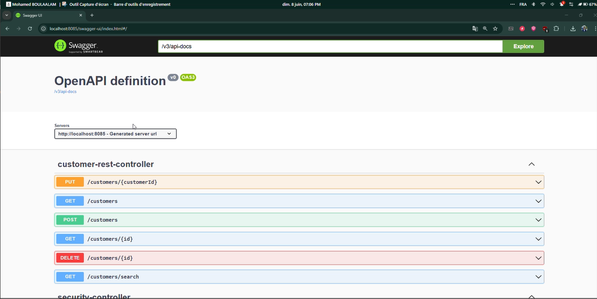
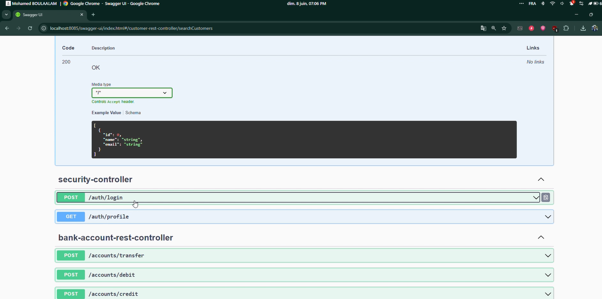
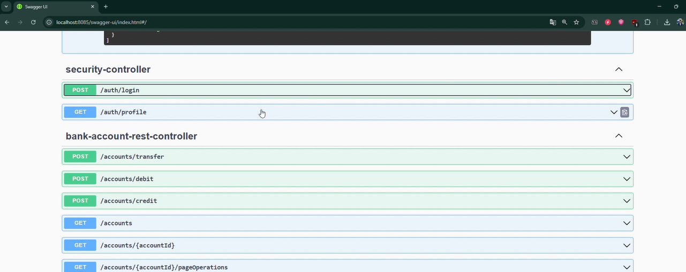
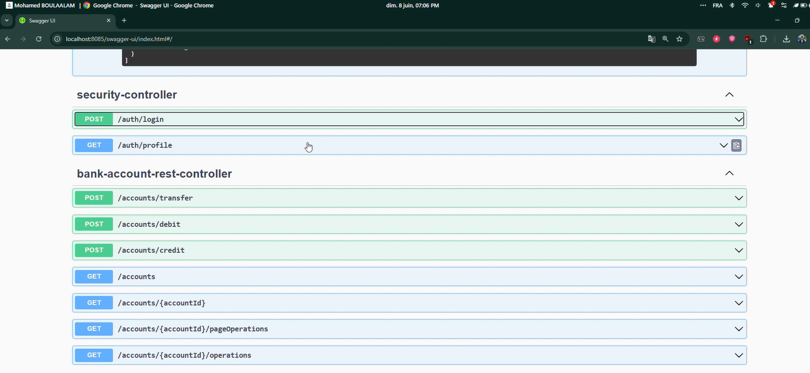
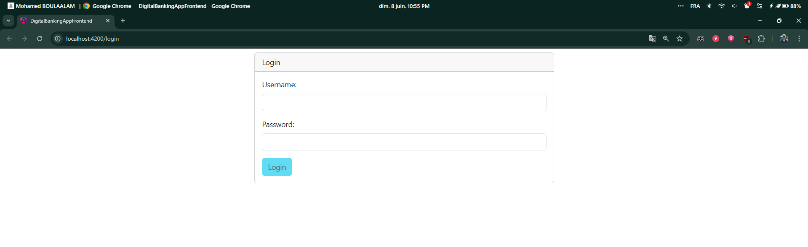
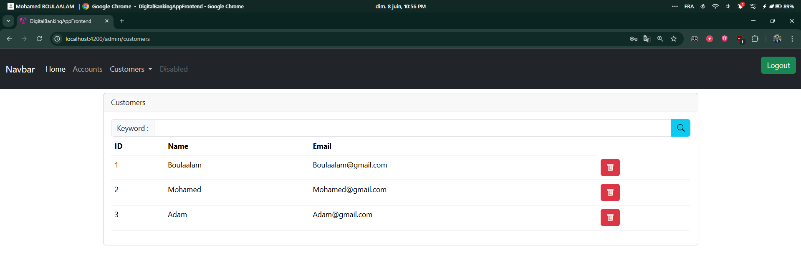

# 💳 Digital Banking App – Full Stack Project (Spring Boot + Angular + JWT)

## 🚀 Introduction

Ce projet est une application bancaire complète permettant de :
- Gérer les **clients** et leurs **comptes** (création, modification, suppression, consultation),
- Réaliser des **opérations bancaires** (débit, crédit, virement),
- Assurer une **sécurité avancée** via Spring Security et JSON Web Token (JWT),
- Fournir une interface **frontend Angular** dynamique avec un système d’authentification sécurisé.

---

## 🧱 Architecture

| Côté | Stack |
|------|-------|
| Backend | Spring Boot, Spring Data JPA, Spring Security, H2/MySQL, Swagger |
| Frontend | Angular 17+, TypeScript, RxJS, Chart.js |
| Auth | JWT (stateless), rôles (ADMIN / USER) |

---

## 📁 Structure du projet
```
DigitalBanking/
├── eBankWeb/                 # Dossier du frontend Angular
├── src/
│   └── main/
│       └── java/
│           └── tech.mobl3lm.digitalbanking/
│               ├── dtos/         # Objets de transfert de données
│               ├── entities/     # Entités JPA : Customer, BankAccount, etc.
│               ├── enums/        # Énumérations : Type d’opération, statut...
│               ├── exceptions/   # Gestion des exceptions personnalisées
│               ├── mappers/      # MapStruct pour conversion Entity <-> DTO
│               ├── repositories/ # Interfaces JPA
│               ├── security/     # Filtres JWT, SecurityConfig, PasswordEncoder...
│               ├── services/     # Services métiers (interfaces + implémentations)
│               ├── web/          # RestControllers (API REST)
│               └── DigitalBankingApplication.java # Classe principale
├── README.md                  # Documentation du projet
├── pom.xml                    # Configuration Maven
```

### Backend – Spring Boot
- `entities/` : Customer, BankAccount (abstract), SavingAccount, CurrentAccount, AccountOperation
- `repositories/` : JPA Repos pour les entités
- `services/` : Couche métier (AccountService)
- `controllers/` : REST Controllers exposant les API
- `security/` : Spring Security config + filtre JWT
- `dto/` : Objets de transfert pour l’API

### Frontend – Angular
- `auth/` : LoginComponent, AuthGuard, JWT Interceptor
- `accounts/` : Liste et détails des comptes, opérations
- `customers/` : Gestion des clients (CRUD)
- `services/` : Connexion API backend via HttpClient

---

## 🔐 Authentification JWT

- Login via `/auth/login`
- Token JWT stocké dans `localStorage`
- Intercepteur HTTP ajoute automatiquement le token dans les requêtes
- Accès sécurisé basé sur les rôles (ADMIN/USER)


---

##  Démonstration

### Swagger UI (backend)





### Interface de connexion (frontend)


### Liste des clients


---

## 🧪 Tests

- ⚙️ Données de test injectées via `CommandLineRunner`
- 🔐 Tests d’authentification avec Postman / Swagger

---

## 📝 Conclusion

Ce projet illustre une architecture professionnelle pour un système bancaire, combinant robustesse du backend Spring Boot et puissance du frontend Angular. Il est sécurisé, modulaire, évolutif, et peut servir de base à toute application financière avancée.

---

## 🧑‍💻 Auteur
Mohamed Boulaalam – Étudiant ingénieur en informatique, Big Data et Cloud Computing.
